# GitHub Copilot & Agents – Benefits Flowchart
## Financial, Insurance & Media Industries

The diagram below shows how GitHub Copilot and GitHub Copilot Agents deliver value across three key industries.

```mermaid
flowchart TD
    A([🚀 GitHub Copilot & Agents]) --> B[Core Copilot Benefits]
    A --> C[Agentic Capabilities]

    %% ── Core Benefits ──────────────────────────────────────────
    B --> B1[⚡ Developer Velocity\n+55% faster code completion]
    B --> B2[🔒 Security & Compliance\nAutofix, secret scanning,\ncode review suggestions]
    B --> B3[📉 Reduced Cognitive Load\nContext-aware suggestions,\ndocumentation generation]
    B --> B4[💰 Cost Efficiency\nFewer defects, faster\ntime-to-market]
    B --> B5[🤝 Knowledge Sharing\nOnboard new engineers faster,\npreserve institutional knowledge]

    %% ── Agentic Capabilities ───────────────────────────────────
    C --> C1[🤖 Copilot Coding Agent\nAutonomously opens PRs,\nfixes issues end-to-end]
    C --> C2[🛠️ MCP & Custom Extensions\nIntegrate internal tools,\nAPIs, and data sources]
    C --> C3[📋 Multi-step Reasoning\nBreak complex tasks into\nactionable sub-tasks]
    C --> C4[🔄 CI/CD Integration\nAutomate pipelines,\ntriggered by natural language]

    %% ── Industry Split ─────────────────────────────────────────
    B1 & B2 & B3 & B4 & B5 --> IND{Industry}
    C1 & C2 & C3 & C4 --> IND

    IND --> FIN[🏦 Financial Services]
    IND --> INS[🛡️ Insurance]
    IND --> MED[🎬 Media & Entertainment]

    %% ── Financial Services ─────────────────────────────────────
    FIN --> F1[Accelerate regulatory\nreporting & compliance code]
    FIN --> F2[Automate fraud-detection\nmodel iteration]
    FIN --> F3[Generate & review\ntrading algorithm logic]
    FIN --> F4[Agent: Auto-remediate\nSOC 2 / PCI-DSS findings]
    FIN --> F5[Agent: Draft audit-ready\nchange summaries in PRs]

    %% ── Insurance ──────────────────────────────────────────────
    INS --> I1[Speed up actuarial &\nrisk-model development]
    INS --> I2[Automate claims-processing\npipeline code]
    INS --> I3[Ensure GDPR / CCPA\ncompliant data handling]
    INS --> I4[Agent: Refactor legacy\npolicy-management systems]
    INS --> I5[Agent: Generate test suites\nfor underwriting rules]

    %% ── Media & Entertainment ──────────────────────────────────
    MED --> M1[Accelerate content delivery\nplatform features]
    MED --> M2[AI-assisted metadata tagging\n& search optimisation]
    MED --> M3[Personalisation engine\ndevelopment at scale]
    MED --> M4[Agent: Automate CDN\nconfiguration & deployment]
    MED --> M5[Agent: Generate API docs\nfor partner integrations]

    %% ── Shared Outcomes ────────────────────────────────────────
    F1 & F2 & F3 & F4 & F5 --> OUT([✅ Shared Outcomes])
    I1 & I2 & I3 & I4 & I5 --> OUT
    M1 & M2 & M3 & M4 & M5 --> OUT

    OUT --> O1[🔐 Stronger Security Posture]
    OUT --> O2[📈 Higher Engineering Throughput]
    OUT --> O3[🏆 Faster Innovation Cycles]
    OUT --> O4[💼 Regulatory Confidence]
    OUT --> O5[😊 Improved Developer Experience]

    %% ── Styles ─────────────────────────────────────────────────
    style A fill:#238636,color:#fff,stroke:#238636
    style IND fill:#0d1117,color:#fff,stroke:#58a6ff
    style OUT fill:#238636,color:#fff,stroke:#238636

    style FIN fill:#1f6feb,color:#fff,stroke:#1f6feb
    style INS fill:#1f6feb,color:#fff,stroke:#1f6feb
    style MED fill:#1f6feb,color:#fff,stroke:#1f6feb

    style B  fill:#21262d,color:#c9d1d9,stroke:#30363d
    style C  fill:#21262d,color:#c9d1d9,stroke:#30363d
```

---

## Key Takeaways by Industry

| Capability | Financial Services | Insurance | Media & Entertainment |
|---|---|---|---|
| **Code Velocity** | Faster regulatory-aligned feature delivery | Rapid iteration on actuarial models | Quicker release of streaming/content features |
| **Security & Compliance** | PCI-DSS, SOX, MiFID II guardrails | GDPR, CCPA, HIPAA-aware code suggestions | IP protection, licensing compliance |
| **Agentic Automation** | Auto-remediate audit findings, draft PR summaries | Refactor legacy policy systems, generate test suites | Automate deployments, generate partner API docs |
| **Cost Reduction** | Fewer defects in critical financial systems | Lower rework costs in claims pipelines | Reduced manual effort in content platform ops |
| **Knowledge Retention** | Preserve quant/domain knowledge in code | Onboard junior developers on complex rules engines | Scale engineering without losing platform expertise |
